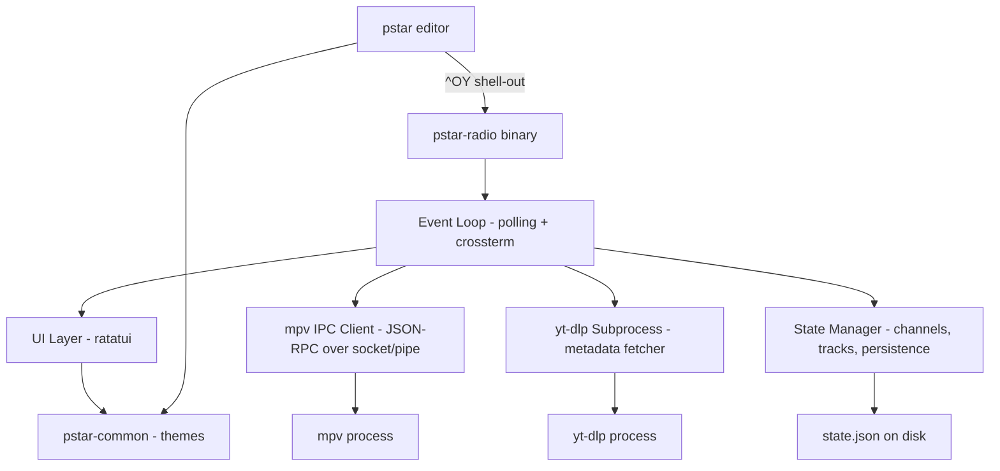

# Design — pstar-radio (YouTube Radio for PerfectStar 2k)

- **Feature slug:** `pstar-radio`
- **Status:** Draft (design phase)
- **Requirements:** [`requirements.md`](./requirements.md)
- **Date:** 2025-07-14
- **Applies to:** PerfectStar 2k workspace — new `pstar-radio` binary + `pstar-common` shared crate + `^OY` integration in `pstar`

---

## 1. Overview

This design maps the pstar-radio requirements onto the PerfectStar 2k
architecture, choosing concrete mechanisms for each component and defining the
workspace restructure needed to support a second binary alongside the existing
editor.

The guiding architectural decision is that pstar-radio is a **standalone TUI
binary** sharing a workspace and theme system with the editor, but otherwise
independent. Communication between pstar and pstar-radio happens through the
filesystem (persisted state) and the operating system (shell-out / child
process), never through shared memory or direct IPC between the two.

### 1.1 Design principles

- **DC4 compliance.** No async runtime. The `polling` crate provides a
  lightweight synchronous event loop consistent with pstar's architecture.
- **Graceful degradation.** Every external tool interaction (`yt-dlp`, `mpv`)
  is guarded; the app never panics due to a missing dependency.
- **Minimal surface.** The radio is ambient — the UI does the least it can.
  The "now playing" status bar is the default; the overlay is opt-in.
- **Shared visual language.** Both binaries render with the same DOS-accurate
  truecolor themes via `pstar-common`.

---

## 2. Workspace Structure

The repo converts from a single package to a Cargo workspace:

```
PerfectStar-2k/
├── Cargo.toml              # [workspace] with members
├── pstar/                  # existing editor (src/ moved here)
│   ├── Cargo.toml
│   └── src/
├── pstar-radio/            # new standalone YouTube radio TUI
│   ├── Cargo.toml
│   └── src/
│       ├── main.rs         # entry point, event loop
│       ├── config.rs       # radio-specific config (TOML)
│       ├── mpv.rs          # mpv IPC client (JSON-RPC)
│       ├── state.rs        # channels, tracks, persistence
│       ├── ui.rs           # ratatui rendering
│       ├── ytdlp.rs        # yt-dlp subprocess wrapper
│       └── platform.rs     # Unix socket / Windows named pipe abstraction
└── pstar-common/           # shared: theme, config path helpers
    ├── Cargo.toml
    └── src/lib.rs
```

This restructure is tracked in ADR-008 (Cargo workspace restructure).

---

## 3. Component Design

### 3.1 Event Loop (`main.rs`)

```
┌─────────────────────────────────────────────────┐
│                  Event Loop                       │
│  polling crate: watch stdin + mpv socket fd      │
│  100ms timeout → tick animations                 │
├─────────────────────────────────────────────────┤
│  stdin ready   → dispatch keypress              │
│  mpv readable  → parse JSON, update player state│
│  timeout       → marquee scroll, elapsed update │
└─────────────────────────────────────────────────┘
```

The main loop uses the `polling` crate to watch:
1. **stdin** — terminal/keyboard events (via crossterm raw mode)
2. **mpv IPC socket/pipe fd** — incoming JSON messages from mpv

On each iteration (100ms poll timeout):
- If terminal input is ready → dispatch keypress to the command handler
- If mpv socket is readable → parse buffered newline-delimited JSON, update player state
- On timeout → tick animations (marquee scroll, elapsed-time display)

The `RadioApp` struct owns all state:
```rust
pub struct RadioApp {
    pub state: RadioState,       // channels, tracks, last-played
    pub config: RadioConfig,     // from config.toml
    pub player: PlayerState,     // playing/paused/stopped, current track, position
    pub mpv: Option<MpvClient>,  // IPC connection (None when not playing)
    pub ui: UiState,             // marquee offset, selected list item, active view
    pub theme: Theme,            // from pstar-common
}
```

### 3.2 yt-dlp Metadata Fetcher (`ytdlp.rs`)

**Responsibility:** Call yt-dlp as a subprocess, parse JSON output into `Channel` and `Track` structs.

```rust
pub struct Channel {
    pub id: String,
    pub name: String,
    pub url: String,
    pub kind: ChannelKind,  // Channel | Playlist
    pub tracks: Vec<String>, // ordered track ids
}

pub struct Track {
    pub id: String,
    pub title: String,
    pub duration_secs: Option<u64>,
    pub url: String,
    pub channel_id: String,
}

pub enum ChannelKind { Channel, Playlist }
```

**URL normalization (R1.3):** If the URL contains `/playlist?list=` it's a playlist; otherwise treat as a channel and append `/videos` if not already present.

**Error handling (R1.5):** `which::which("yt-dlp")` check before spawning. On failure, return a typed error surfaced in the UI.

### 3.3 State Persistence (`state.rs`)

```rust
pub struct RadioState {
    pub version: u32,
    pub channels: BTreeMap<String, Channel>,
    pub tracks: BTreeMap<String, Track>,
    pub last_played: Option<String>,  // track id
}
```

**Storage:** `<data_local_dir>/pstar-radio/state.json` (via `dirs` crate).

**Atomic save (R5.3):** Write to a `.tmp` file in the same directory, then `fs::rename` over the target — identical pattern to pstar's `Buffer::save`.

**Navigation helpers:**
- `all_tracks() -> Vec<&Track>` — all tracks in channel-then-listing order
- `next_track(current_id) -> Option<&Track>`
- `previous_track(current_id) -> Option<&Track>`

**Resilience (R5.5):** `load()` returns `Ok(default)` on missing/corrupt file.

### 3.4 mpv IPC Client (`mpv.rs`)

**Spawn:** `mpv --no-video --force-window=no --input-ipc-server=<socket_path> <url>`

**Connection (R4.2):** Retry loop at 50ms intervals for up to 2 seconds after spawn, since the socket appears asynchronously.

**Protocol:** Newline-delimited JSON-RPC over the socket. Commands sent as `{"command": [...]}`, responses and events received as JSON objects.

**Commands issued:**
- `loadfile <url>` — play a track
- `set pause yes/no` — pause/resume
- `seek <seconds>` — relative seek
- `get_property time-pos` — poll position

**Events observed (R4.3–4.4):**
```rust
pub enum MpvEvent {
    PropertyChange { name: String, data: serde_json::Value },
    EndFile { reason: String, error: Option<String> },
    Position(f64),
}
```

**Non-blocking reads (R4.5):** After connection, the socket fd is set non-blocking and registered with the `polling` event loop.

**Disconnection (R4.6):** EOF or read error → set `PlayerState::Stopped`, clear `mpv` field.

### 3.5 Platform Abstraction (`platform.rs`)

```rust
pub trait IpcStream: Read + Write {
    fn as_raw_fd(&self) -> RawFd;  // for polling registration
}

#[cfg(unix)]
pub struct UnixIpcStream(UnixStream);

#[cfg(windows)]
pub struct PipeIpcStream(/* named pipe handle */);
```

**Unix (R10.1):** Socket at `/tmp/pstar-radio-mpv-<pid>.sock` (or `$TMPDIR`).

**Windows (R10.2):** Named pipe at `\\.\pipe\pstar-radio-mpv-<random>`.

**Open-in-browser (R10.4):** Platform dispatch via `open` / `xdg-open` / `start`.

### 3.6 User Interface (`ui.rs`)

**Layout:**
```
┌─────────────────────────────────────────┐
│                                         │
│          Main Area                      │
│   (now-playing card OR track/channel    │
│    list when browsing)                  │
│                                         │
├─────────────────────────────────────────┤
│  Controls hint: space:⏯ n:next p:prev  │
├─────────────────────────────────────────┤
│  ▶ Track Title (marquee) ── 2:34/4:12  │
└─────────────────────────────────────────┘
```

**Marquee algorithm (R6.5):** Bounce scroll — advance offset right until the end of the title is visible, pause 2 ticks, then scroll left back to the start, pause 2 ticks. Tick rate: 4 per second (every 250ms, driven by the event loop timeout).

**Themes (R6.7):** Import `pstar_common::theme::Theme` and apply `fg`/`bg` colors to ratatui `Style` objects. Theme selected via config or default `wp-blue`.

**Play-state icons (R6.6):** `▶` playing, `⏸` paused, `■` stopped, `◁◁` previous, `▷▷` next.

### 3.7 Configuration (`config.rs`)

```rust
#[derive(Deserialize, Default)]
pub struct RadioConfig {
    pub theme: Option<String>,
    pub channels: Vec<ConfigChannel>,
    pub seek_seconds: Option<u64>,        // default 5
    pub seek_large_seconds: Option<u64>,  // default 60
}

#[derive(Deserialize)]
pub struct ConfigChannel {
    pub name: String,
    pub url: String,
}
```

**Location (R8.1):** `<config_dir>/pstar-radio/config.toml` (via `dirs` crate).

**Pinned channels (R8.4):** Channels loaded from config are marked with a `pinned: true` flag in state and cannot be removed via the `-` command.

**Auto-fetch (R8.3):** On launch, if a config channel's URL is not already in state, fetch it via yt-dlp and add it.

### 3.8 Editor Integration (`^OY` in pstar)

**Mechanism (R9.1–2):**
1. New `Cmd::Radio` variant + `Binding` row: `Pref(O, 'y')` → "YouTube radio"
2. On dispatch: locate `pstar-radio` binary (adjacent to self, then PATH)
3. Suspend terminal: `ratatui::restore()` (leave alternate screen, disable raw mode)
4. `std::process::Command::new(radio_path).status()` — blocking wait
5. Re-init terminal: `ratatui::init()` (re-enter alternate screen, enable raw mode)
6. Redraw the editor

**Binary discovery (R9.4):** Check `std::env::current_exe()` directory first, then fall back to PATH lookup. If not found, display "pstar-radio not found" in the status bar.

---

## 4. Data Flow



---

## 5. Decisions and ADR References

| Decision | Resolution | ADR |
|----------|-----------|-----|
| Cargo workspace restructure | Move `src/` into `pstar/`, add `pstar-common` and `pstar-radio` members | ADR-008 |
| Event loop strategy | `polling` crate, synchronous, 100ms tick | ADR-009 |
| Cross-platform mpv IPC | Trait-based abstraction with `#[cfg]` impls; Unix sockets + Windows named pipes | ADR-010 |
| Editor integration mechanism | Shell-out (suspend terminal, spawn child, restore) vs. embedded overlay | ADR-011 |
| Windows named pipe crate | `interprocess` vs. raw `windows-sys` — decide during implementation (Task 9) | TBD |

---

## 6. Requirements → Design Traceability

| Req | Component(s) | Key mechanism |
|-----|-------------|---------------|
| R1 | `ytdlp.rs`, `state.rs` | Subprocess spawn + JSON parse, URL normalization |
| R2 | `state.rs`, `ui.rs` | `all_tracks()` navigation, filterable list mode |
| R3 | `mpv.rs`, `main.rs` | IPC commands, auto-advance on `EndFile` event |
| R4 | `mpv.rs`, `platform.rs` | JSON-RPC client, retry loop, non-blocking reads via polling |
| R5 | `state.rs` | Atomic JSON save/load, version field, graceful corruption handling |
| R6 | `ui.rs`, `pstar-common` | ratatui layout, marquee bounce algorithm, shared themes |
| R7 | `main.rs` | Key dispatch in event loop, single-key bindings |
| R8 | `config.rs`, `state.rs` | TOML parse, pinned channels, auto-fetch on first launch |
| R9 | pstar `app.rs`, `keymap.rs` | `Cmd::Radio`, terminal suspend/restore, binary discovery |
| R10 | `platform.rs` | `IpcStream` trait, `#[cfg(unix)]` / `#[cfg(windows)]`, platform browser open |

---

## 7. Next Step

Proceed to **`tasks.md`** — an ordered implementation task list derived from
this design, sequenced for incremental, test-driven delivery where each task
results in a working, demoable increment.
