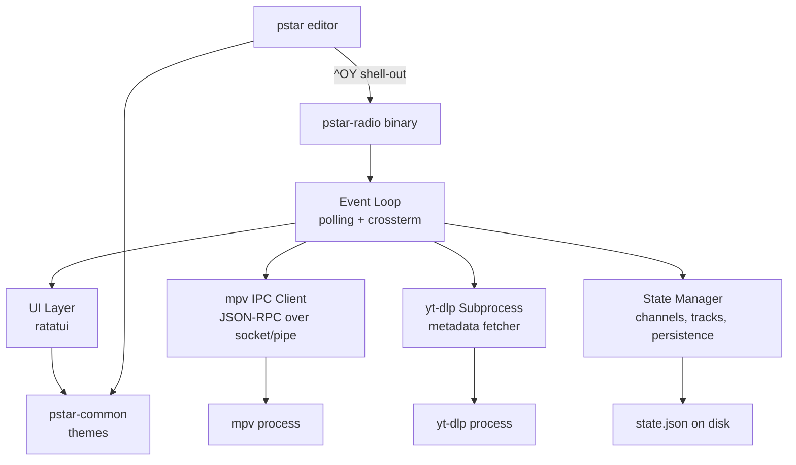

# Requirements — pstar-radio (YouTube Radio for PerfectStar 2k)

- **Feature slug:** `pstar-radio`
- **Status:** Approved
- **Author:** Spec development workflow
- **Date:** 2025-07-14
- **Applies to:** PerfectStar 2k workspace — new `pstar-radio` binary + `pstar-common` shared crate + `^OY` integration in `pstar`

---

## 1. Introduction

Writers work better with background music. `ytr` (YouTube radio) is an Emacs
Lisp package by Alvaro Ramirez that streams audio from YouTube channels and
playlists via `yt-dlp` + `mpv` — a minimal, keyboard-driven jukebox for
focused work. This spec defines a Rust port of ytr's core functionality as a
standalone TUI binary (`pstar-radio`) within the PerfectStar 2k workspace,
with an integration hook (`^OY`) in the editor.

### 1.1 Design constraints

- **DC1 — Workspace member.** `pstar-radio` lives in the same Cargo workspace
  as `pstar`, sharing dependencies and the theme system via a `pstar-common`
  crate.
- **DC2 — External dependencies.** Requires `yt-dlp` and `mpv` in PATH. These
  are runtime, not build-time, dependencies. The binary degrades gracefully
  when either is absent.
- **DC3 — Cross-platform IPC.** mpv communicates via Unix domain sockets
  (macOS/Linux) or named pipes (Windows). Both must be supported.
- **DC4 — No async runtime.** Uses the `polling` crate for a lightweight event
  loop, consistent with pstar's synchronous architecture.
- **DC5 — Ambient UX.** The radio is background accompaniment for writing. The
  interface is minimal: a status bar with now-playing info and a toggle overlay
  for controls. It should never demand attention.
- **DC6 — Shared theming.** Visual appearance uses pstar's existing theme
  system (wp-blue, wordstar, terminal-default), extracted into `pstar-common`.

### 1.2 Prior art

- [xenodium/ytr](https://github.com/xenodium/ytr) — the Emacs package being
  ported (~1600 LOC Elisp)
- Core ytr features: add/remove YouTube channels by URL, fetch track listings
  via yt-dlp, play audio via mpv (IPC over Unix socket), persist state,
  play/pause/next/prev/seek, marquee title scrolling, auto-advance

### 1.3 Out of scope

- Video playback or thumbnails (audio only)
- Streaming sources other than YouTube
- Embedding the radio's full UI inline within pstar's TUI (future work; this
  spec covers shell-out via `^OY`)
- Mobile or web interfaces
- User authentication / private YouTube content

---

## 2. Glossary

- **Channel** — a YouTube channel or playlist treated as an ordered collection
  of tracks.
- **Track** — a single YouTube video treated as an audio stream (id, title,
  duration, URL, channel membership).
- **State** — the persisted catalog of channels and their tracks, plus
  last-played position, saved as JSON.
- **IPC** — inter-process communication with mpv via JSON-RPC over a Unix
  domain socket or Windows named pipe.
- **Overlay** — the full-screen player view showing controls and track info
  (toggled on/off from the status bar view).

---

## 3. Architecture

### 3.1 Workspace structure

```
PerfectStar-2k/
├── Cargo.toml              # [workspace] with members
├── pstar/                  # existing editor (renamed from src/)
│   ├── Cargo.toml
│   └── src/
├── pstar-radio/            # new standalone YouTube radio TUI
│   ├── Cargo.toml
│   └── src/
│       ├── main.rs         # entry point, event loop
│       ├── config.rs       # radio-specific config
│       ├── mpv.rs          # mpv IPC client
│       ├── state.rs        # channels, tracks, persistence
│       ├── ui.rs           # ratatui rendering
│       ├── ytdlp.rs        # yt-dlp subprocess wrapper
│       └── platform.rs     # Unix socket / Windows named pipe abstraction
└── pstar-common/           # shared: theme, config path helpers
    ├── Cargo.toml
    └── src/lib.rs
```

### 3.2 Component diagram



### 3.3 Event loop design

The main loop uses the `polling` crate to watch:
1. **stdin** — terminal/keyboard events (via crossterm raw mode)
2. **mpv IPC socket/pipe fd** — incoming JSON messages from mpv

On each iteration (100ms timeout):
- If terminal input is ready → dispatch keypress
- If mpv socket is readable → parse buffered newline-delimited JSON, update
  player state
- On timeout → tick animations (marquee scroll, elapsed-time display)

---

## 4. Requirements

### R1 — Channel management

1. The system SHALL let the user add a YouTube channel or playlist by URL.
2. WHEN a channel is added, the system SHALL fetch its track listing via
   `yt-dlp --flat-playlist --dump-single-json` and store it in state.
3. The system SHALL distinguish channels (append `/videos` to URL) from
   playlists (use URL as-is) using query-string detection.
4. The system SHALL let the user remove a channel and all its tracks from the
   catalog, with confirmation.
5. IF `yt-dlp` is not in PATH, THEN the system SHALL display a clear error and
   refuse the operation.
6. Channel metadata SHALL include: id, display name, URL, kind
   (channel/playlist), and an ordered list of track ids.

### R2 — Track browsing and selection

1. The system SHALL present all tracks across all channels in a scrollable,
   filterable list.
2. The system SHALL show each track as "Channel Name - Track Title" with
   duration.
3. WHEN the user selects a track, the system SHALL begin playback immediately.
4. The system SHALL provide a channel-selection view that plays the first track
   of the chosen channel.
5. Track ordering SHALL be channel-then-listing-order (the order yt-dlp returns
   them).

### R3 — Playback control

1. The system SHALL play audio via `mpv --no-video --force-window=no` with IPC
   enabled.
2. The system SHALL support: play, pause, toggle, next track, previous track,
   seek forward, seek backward.
3. WHEN a track ends normally (mpv exit 0), the system SHALL auto-advance to
   the next track in catalog order.
4. IF there is no next track, THEN playback SHALL stop gracefully.
5. The system SHALL display elapsed time (polled from mpv each second) and
   total duration.
6. Seek SHALL default to 5 seconds; a "large seek" SHALL default to 60 seconds
   (configurable).
7. IF `mpv` is not in PATH, THEN the system SHALL display a clear error at
   startup or first play attempt.
8. IF mpv reports a playback error, THEN the system SHALL display the error and
   stop (not crash).

### R4 — mpv IPC

1. The system SHALL connect to mpv via a Unix domain socket (macOS/Linux) or
   named pipe (Windows).
2. Connection SHALL retry with backoff (50ms intervals, up to 2 seconds) since
   the socket appears after mpv spawns.
3. The system SHALL observe mpv properties: `pause`, `core-idle`, and poll
   `time-pos`.
4. The system SHALL handle mpv events: `property-change`, `end-file` (including
   error reason).
5. The IPC stream SHALL be set to non-blocking after connection, read via the
   polling event loop.
6. IF the IPC connection drops unexpectedly, THEN the system SHALL treat
   playback as stopped.

### R5 — State persistence

1. The system SHALL persist state as JSON at
   `<data_local_dir>/pstar-radio/state.json`.
2. State SHALL include: a version field, all channels with their tracks, and
   last-played track id.
3. Saves SHALL be atomic (write temp file, rename).
4. WHEN the app launches, the system SHALL load state and resume from the
   last-played track (ready to play, not auto-playing).
5. IF the state file is missing or corrupt, THEN the system SHALL start with an
   empty catalog (no crash).

### R6 — User interface

1. The system SHALL render a TUI using ratatui with the shared pstar theme
   (wp-blue default).
2. The system SHALL show a **status bar** (bottom line) with: play-state icon,
   track title (marquee-scrolling if wider than available columns),
   elapsed/duration.
3. The system SHALL show a **main area** with: "now playing" card (track,
   channel, controls hint) or the active list (tracks/channels) when browsing.
4. The system SHALL show a **controls hint** line with available keys.
5. Marquee scrolling SHALL bounce (scroll to end, pause, scroll back, pause) at
   4 ticks/second.
6. Play-state icons SHALL be Unicode: `▶` playing, `⏸` paused, `■` stopped,
   `◁◁` previous, `▷▷` next.
7. The system SHALL support all three pstar themes, selectable in config.

### R7 — Key bindings

| Key | Action |
|-----|--------|
| `space` | toggle play/pause; resume last-played if stopped |
| `n` | next track |
| `p` | previous track |
| `f` | seek forward (5s; configurable) |
| `b` | seek backward (5s; configurable) |
| `+` | add channel (prompts for URL) |
| `-` | remove channel (shows list, confirms) |
| `/` | pick a track (filterable list) |
| `c` | pick a channel to play |
| `o` | open current track in browser |
| `q` | quit (stop playback, save state, exit) |

### R8 — Configuration

1. The system SHALL read config from `<config_dir>/pstar-radio/config.toml`.
2. Configurable fields: `theme` (string), `channels` (array of
   `{ name, url }`), `seek_seconds` (default 5), `seek_large_seconds`
   (default 60).
3. Channels in config SHALL be auto-fetched on first launch if not already in
   state.
4. Config channels SHALL be "pinned" — not removable via the `-` command.
5. WHERE no config file exists, the system SHALL use defaults and operate
   normally.

### R9 — Integration with pstar editor

1. The `pstar` editor SHALL gain a `Cmd::Radio` command bound to `^OY`
   ("YouTube radio").
2. WHEN `^OY` is pressed, the system SHALL: suspend the terminal, launch
   `pstar-radio` as a child process, and restore the terminal on return.
3. The command SHALL appear in the command palette with the name "YouTube
   radio".
4. IF `pstar-radio` is not found in PATH (or adjacent to the pstar binary),
   THEN the system SHALL display "pstar-radio not found" in the status bar.
5. Playback state persists across invocations (via the state file), so quitting
   the radio and re-invoking it later resumes where the user left off.

### R10 — Cross-platform support

1. On macOS/Linux: mpv IPC SHALL use Unix domain sockets in a temp directory.
2. On Windows: mpv IPC SHALL use named pipes
   (`\\.\pipe\pstar-radio-mpv-<random>`).
3. Platform-specific code SHALL be isolated behind a trait
   (`IpcStream: Read + Write`) with `#[cfg]` implementations.
4. The `open in browser` command SHALL use `open` (macOS), `xdg-open` (Linux),
   or `start` (Windows).

---

## 5. Dependencies (new)

| Crate | Purpose | Used by |
|-------|---------|---------|
| `polling` | Lightweight event loop (fd watching) | pstar-radio |
| `serde` + `serde_json` | JSON parsing (yt-dlp output, mpv IPC, state file) | pstar-radio (already in workspace) |
| `toml` | Config file parsing | pstar-radio (already in workspace) |
| `dirs` | Platform config/data/state directories | pstar-radio (already in workspace) |
| `ratatui` + `crossterm` | TUI rendering and terminal I/O | pstar-radio (already in workspace) |
| `interprocess` or equivalent | Windows named pipe support | pstar-radio (Windows only) |

---

## 6. Task breakdown

Tasks are ordered for incremental, test-driven delivery. Each task results in a
working, demoable increment.

### Task 1: Convert the repo to a Cargo workspace

- **Objective:** Restructure PerfectStar-2k from a single package into a
  workspace with the existing editor as `pstar/` and stub crates for
  `pstar-common` and `pstar-radio`.
- **Implementation:** Create top-level `[workspace]` Cargo.toml. Move existing
  `src/` into `pstar/src/` with its own Cargo.toml preserving all deps and the
  `[[bin]]` section. Create `pstar-common/` with a no-op `lib.rs`. Create
  `pstar-radio/` with a hello-world `main.rs`.
- **Test:** `cargo build --workspace` succeeds. `cargo run -p perfectstar2k --
  draft.md` launches editor unchanged. `cargo run -p pstar-radio` prints its
  name.
- **Demo:** The repo builds as a workspace; existing editor is unaffected; new
  binary stub runs.

### Task 2: Extract shared theme into pstar-common

- **Objective:** Move the theme types and DOS color palette into `pstar-common`
  so both binaries share the same visual language.
- **Implementation:** Extract `Theme`, `ThemeKind`, and the `dos` color
  constants from `pstar/src/theme.rs` into `pstar-common/src/theme.rs`. The
  editor's `theme.rs` re-exports or wraps `pstar-common::theme`, adding
  editor-specific fields (markdown styles, etc.). `pstar-radio` depends on
  `pstar-common` for theming.
- **Test:** `cargo build --workspace` succeeds. Editor renders all three themes
  correctly.
- **Demo:** Both crates compile against shared theme; theme switching in editor
  unaffected.

### Task 3: Implement the yt-dlp metadata fetcher

- **Objective:** Build `pstar-radio/src/ytdlp.rs` — call yt-dlp, parse JSON
  into `Channel` and `Track` structs.
- **Implementation:** Define structs with serde. Implement
  `fetch_channel(url) -> Result<Channel>`. Handle channel-vs-playlist URL
  normalization. Check yt-dlp is in PATH.
- **Test:** Unit test parsing a saved JSON fixture. Integration test (ignored)
  fetching a real channel.
- **Demo:** `cargo test -p pstar-radio` passes; test binary can fetch and print
  a real channel's track listing.

### Task 4: Implement state persistence

- **Objective:** Build `pstar-radio/src/state.rs` — the catalog and player
  state with JSON persistence.
- **Implementation:** `RadioState` with `BTreeMap<String, Channel>`,
  `last_played`. Atomic save/load. Navigation helpers: `all_tracks()`,
  `next_track()`, `previous_track()`. Version field for migration.
- **Test:** Round-trip save/load, track navigation ordering, graceful handling
  of missing/corrupt files.
- **Demo:** State persists across process restarts; tracks navigable in order.

### Task 5: Implement the platform-abstracted mpv IPC client

- **Objective:** Build `platform.rs` (socket/pipe abstraction) and `mpv.rs`
  (spawn mpv, connect, send commands, receive events).
- **Implementation:** `IpcStream` trait with Unix and Windows impls.
  `MpvClient` with spawn, connect (retry loop), send_command, request,
  poll_events. Non-blocking reads. `MpvEvent` enum: `Playing`, `Paused`,
  `Idle`, `EndFile`, `Position(f64)`.
- **Test:** Unit test parsing sample mpv JSON into events. Integration test
  (ignored) spawning mpv with a short URL.
- **Demo:** Can spawn mpv, play a URL, toggle pause, read position, detect
  track end.

### Task 6: Build the TUI event loop with polling

- **Objective:** Build the main event loop multiplexing terminal input, mpv
  IPC, and tick timers.
- **Implementation:** Add `polling` dep. Watch stdin + mpv socket fd. Main
  loop: poll(100ms), dispatch keys or mpv events or tick. Define `RadioApp`
  struct. Wire crossterm alternate-screen + raw mode.
- **Test:** App starts, shows empty state, quits on `q`.
- **Demo:** Radio binary starts, shows an empty player screen, accepts input,
  exits cleanly.

### Task 7: Implement the player UI (status bar + overlay)

- **Objective:** Render the player using ratatui with pstar themes.
- **Implementation:** Layout: status bar (always), main area (now-playing card
  or list), controls hint. Marquee bouncing algorithm. Elapsed time display.
  Play-state icons. Theme application from pstar-common.
- **Test:** Render to TestBackend, assert key spans present in known states.
- **Demo:** Running pstar-radio shows themed player; with a track loaded,
  displays scrolling title and elapsed time.

### Task 8: Implement interactive commands

- **Objective:** Wire up all keyboard commands for full ytr feature parity.
- **Implementation:** All bindings from R7. Input prompts (URL entry). List
  selection with filtering (tracks, channels). Auto-advance on track end.
  Open-in-browser via platform command.
- **Test:** Unit tests for state transitions (add/remove channel, next/prev).
  Manual test script for full interactive session.
- **Demo:** Full session — add channel, browse tracks, play, skip, seek, remove
  channel, re-launch and resume.

### Task 9: Cross-platform IPC (Windows named pipes)

- **Objective:** Implement the Windows side of `platform.rs`.
- **Implementation:** Use `interprocess` crate or raw Win32 API. Named pipe at
  `\\.\pipe\pstar-radio-mpv-<random>`. Same retry logic. `#[cfg(windows)]`
  conditional compilation.
- **Test:** Compiles for Windows target. Integration test (ignored) on Windows.
- **Demo:** `pstar-radio` builds and runs on Windows, connecting to mpv via
  named pipe.

### Task 10: Configuration file

- **Objective:** Add TOML config for theme, preset channels, and seek
  durations.
- **Implementation:** Config at `<config_dir>/pstar-radio/config.toml`.
  Auto-fetch config channels on first launch. Pinned channels not removable.
  Defaults for missing fields.
- **Test:** Parse sample config. Launch with config containing a channel, verify
  it loads.
- **Demo:** User creates config with a channel URL; on first launch it's
  fetched and ready.

### Task 11: Integration hook in pstar (`^OY`)

- **Objective:** Add `^OY` to the editor that launches pstar-radio as a child
  process.
- **Implementation:** Add `Cmd::Radio` + `Pref(O, 'y')` binding. On trigger:
  find pstar-radio binary, suspend terminal (`ratatui::restore()`), spawn and
  wait, re-init terminal. Status message on not-found.
- **Test:** Binding appears in palette. Error shown when binary missing. Clean
  round-trip when available.
- **Demo:** From pstar, press `^OY` — terminal switches to radio; quit radio,
  back in document.

---

## 7. Open questions

1. **`interprocess` vs raw Win32 for Windows pipes.** The `interprocess` crate
   provides a portable abstraction but adds a dependency. Raw Win32 via
   `windows-sys` is zero-dep but more code. Decide during Task 9.
2. **Refresh of channel listings.** ytr re-fetches on demand. Should
   pstar-radio auto-refresh on launch, or only when the user explicitly
   requests? Current spec: manual only (user presses `+` on an existing channel
   to refresh).
3. **Shuffle / random mode.** ytr plays in listing order. A shuffle toggle
   would be a natural future addition but is out of scope for v1.
4. **Embedded radio (future).** The current integration is shell-out. A future
   version could embed the radio as an in-process overlay within pstar's event
   loop (sharing the terminal). This would require the radio logic to be a
   library crate, not just a binary. The workspace structure supports this
   evolution.

---

## 8. Traceability

- This spec originates from a feasibility assessment of porting
  [xenodium/ytr](https://github.com/xenodium/ytr) to Rust.
- Requirements R1–R10 are individually traceable to tasks 1–11.
- The `^OY` integration (R9, Task 11) connects this feature to the main pstar
  editor without coupling their implementations.
- Related ADRs: ADR-008 (workspace restructure), ADR-009 (polling crate),
  ADR-010 (cross-platform mpv IPC), ADR-011 (shell-out integration).
